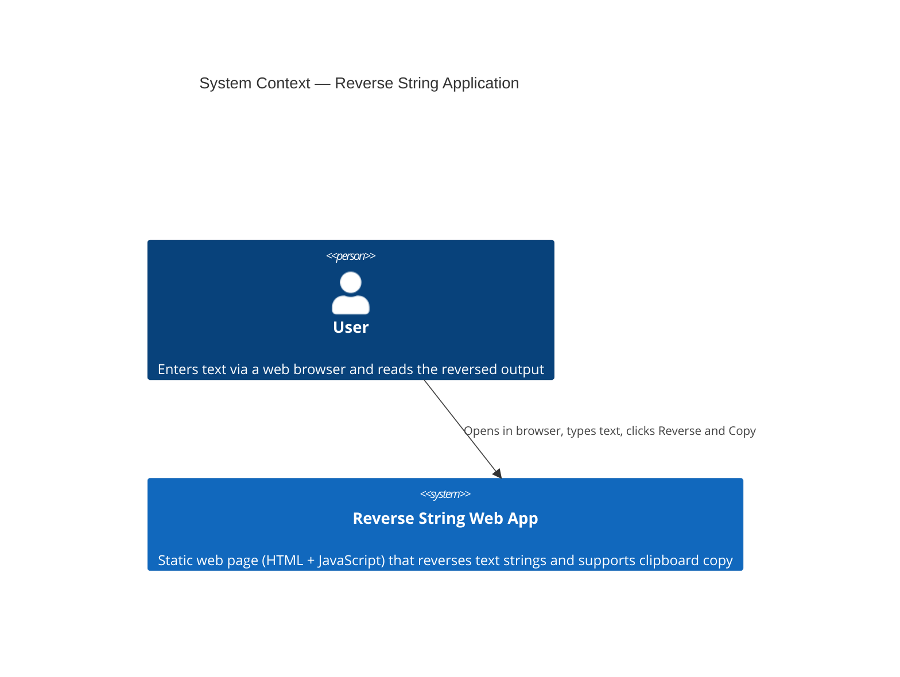
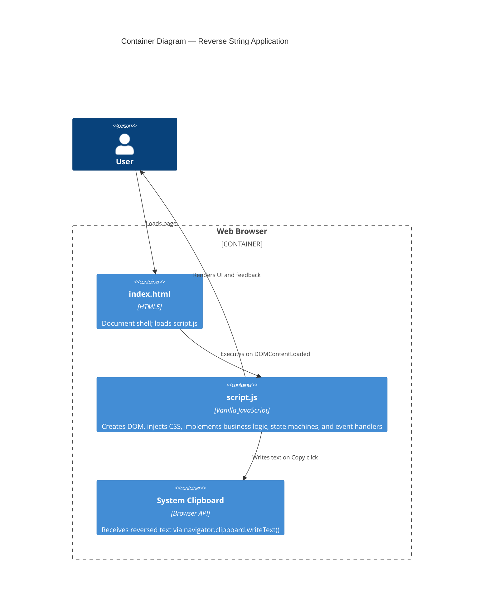
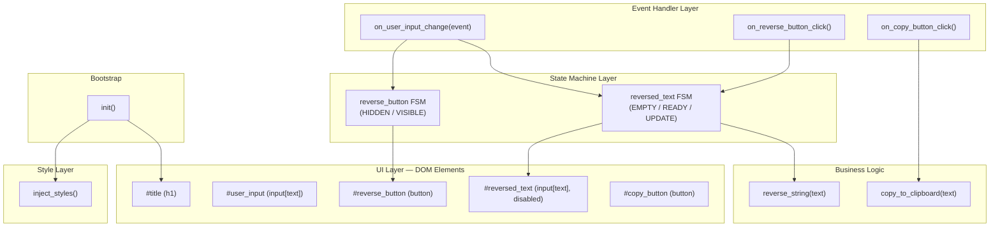
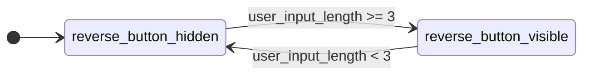
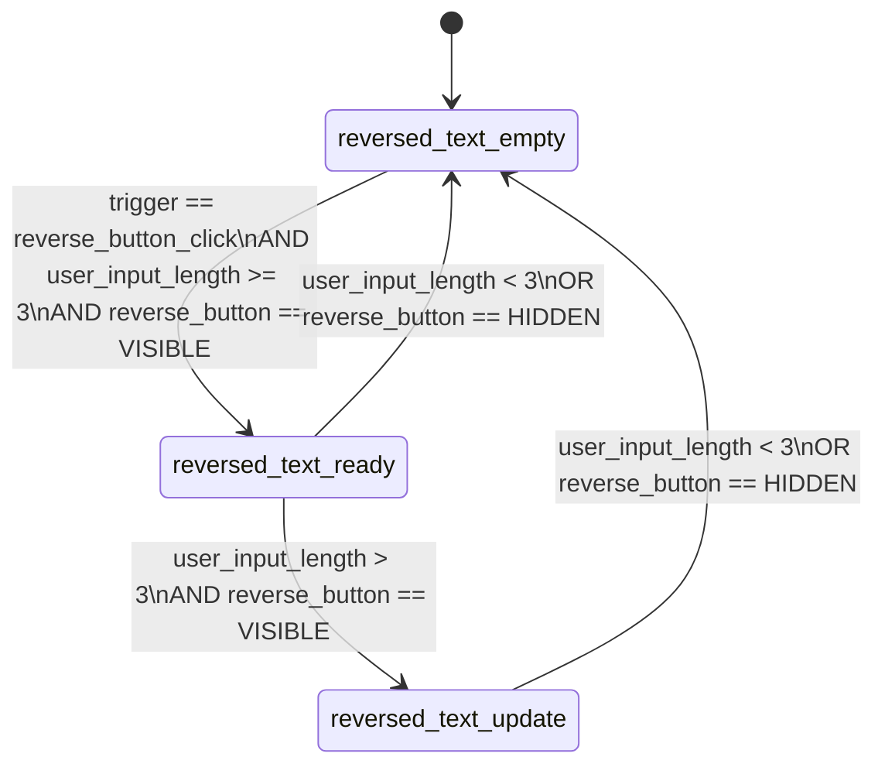

# Reverse String — Architecture and Development Guide

## 1. Problem Statement

Build a static web page (HTML + JavaScript, no server) that:
- Presents a text input where the user types freely.
- Shows a **Reverse** button that appears only when the input has ≥ 3 characters.
- On click, computes and displays the reversed string in a read-only output field.
- While the output is visible, auto-updates in real time whenever the user continues typing (length > 3).
- Clears the output and hides the button whenever the input drops below 3 characters.
- Provides a **Copy** button that copies the reversed text to the clipboard.

**Canonical reversal example:**
Input: `I think AI4Devs is awesome!`
Output: `!emosewa si sveD4IA kniht I`

---

## 2. C4 Architecture Model

### Level 1 — System Context



### Level 2 — Container



### Level 3 — Component



### Level 4 — Code (Key Function Signatures)

| Function | Signature | Purpose |
|---|---|---|
| `reverse_string` | `(text: string) → string` | Character-level string reversal |
| `copy_to_clipboard` | `(text: string) → Promise<void>` | Writes to system clipboard |
| `inject_styles` | `() → void` | Inserts `<style>` tag into `<head>` |
| `create_dom_elements` | `() → void` | Builds and appends all UI elements |
| `transition_reverse_button` | `(user_input_length: number) → void` | Drives reverse_button FSM |
| `apply_reverse_button_state` | `() → void` | Renders reverse_button FSM state |
| `transition_reversed_text` | `(trigger: string, user_input_length: number) → void` | Drives reversed_text FSM |
| `apply_reversed_text_state` | `() → void` | Renders reversed_text FSM state |
| `on_user_input_change` | `(event: InputEvent) → void` | Input event handler |
| `on_reverse_button_click` | `() → void` | Reverse button click handler |
| `on_copy_button_click` | `() → Promise<void>` | Copy button click handler |
| `init` | `() → void` | Application entry point |

---

## 3. State Machine Diagrams

### 3.1 reverse_button FSM



### 3.2 reversed_text FSM



**State semantics:**

| State | `reversed_text` content |
|---|---|
| `reversed_text_empty` | Empty string `""` |
| `reversed_text_ready` | Snapshot of `reverse_string(user_input)` captured at click time |
| `reversed_text_update` | Live result of `reverse_string(user_input.value)`, re-evaluated on every keystroke |

---

## 4. BDD Scenarios

```gherkin
Feature: Reverse String Web Application

  Background:
    Given the user has opened the Reverse String web page

  Scenario: Initial state
    Then the reverse_button should not be visible
    And the reversed_text field should be empty

  Scenario: Button appears at 3 characters
    When the user types "abc" in user_input
    Then the reverse_button should be visible

  Scenario: Button hides below 3 characters
    Given the user has typed "abc" making reverse_button visible
    When the user deletes one character leaving "ab"
    Then the reverse_button should not be visible

  Scenario: Reversed text appears on click
    Given user_input contains "hello"
    When the user clicks reverse_button
    Then reversed_text should contain "olleh"

  Scenario: Canonical reversal example
    Given user_input contains "I think AI4Devs is awesome!"
    When the user clicks reverse_button
    Then reversed_text should contain "!emosewa si sveD4IA kniht I"

  Scenario: Auto-update after first click (length > 3)
    Given the user clicked reverse_button with "abc" showing "cba"
    When the user types "d" making user_input "abcd"
    Then reversed_text should auto-update to "dcba"

  Scenario: Output clears when input drops below 3
    Given reversed_text shows a reversed string
    When user_input length drops below 3
    Then reversed_text should be empty

  Scenario: Copy reversed text
    Given reversed_text contains "olleh"
    When the user clicks copy_button
    Then the clipboard should contain "olleh"
```

---

## 5. Implementation Stages

| # | Stage | Target file | Verification |
|---|---|---|---|
| 1 | Documentation files | `plan.md`, `task.md`, `user-manual.md` | Files exist and are readable |
| 2 | DOM Structure | `script.js` | DevTools shows 5 elements in `#container` |
| 3 | Vertical alignment | `script.js` (CSS) | Elements stack top-to-bottom, left-aligned |
| 4 | Visual styles | `script.js` (CSS) | Matches example image visually |
| 5 | `reverse_string()` | `script.js` | Console test passes |
| 6 | `copy_to_clipboard()` | `script.js` | Console test passes |
| 7 | reverse_button FSM | `script.js` | Button shows/hides on input length change |
| 8 | reversed_text FSM | `script.js` | All FSM transitions work correctly |
| 9 | Event handlers + init | `script.js` | End-to-end flow works |
| 10 | prompts.md | `prompts.md` | Interaction is documented |
